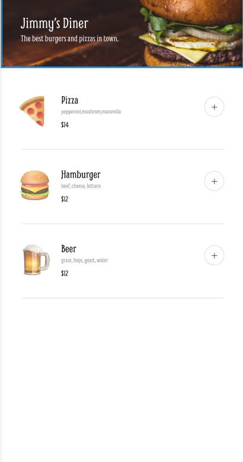

# 🍽️ Meal Sprint  
> A fast and intuitive restaurant ordering web app that helps users browse meals, add items to cart, and place orders effortlessly.

---

## 🪞 Overview  
Meal Sprint is a beginner-friendly and fully responsive ordering interface designed to mimic real restaurant ordering systems.  
It aims to make the food-ordering journey smooth and modern.  
This project is perfect for learners who want hands-on experience with UI design, DOM manipulation, and building real-world web features.

---

## 🚀 Features  
*(Will be updated as features are added)*  

- 🎯 Feature 1  
- 🧠 Feature 2  
- 📱 Feature 3  
- 🌙 Feature 4  

---

## 🧱 Tech Stack  

| Technology | Purpose |
|-----------|----------|
| **HTML5** | App structure |
| **CSS3** | Styling & layout |
| **JavaScript (ES6)** | Logic & interactivity |
| *(Optional)* **API / React / Backend** | To be added later |

---

## 📚 What We Have Studied  

> Concepts practiced include:  
> 

---

## 🌿 Lessons Learned  

- Improved DOM manipulation skills  
- Better event & state management understanding  
- Experience writing modular, clean code  

---

## 🖼️ Screenshots / Demo  

🔗 **Live Demo:** *(Add link here)*

---

## 💫 Author  
👩‍💻 **Created by Aliya**  
> _“Build. Break. Learn. Repeat.”_ 🌸  

